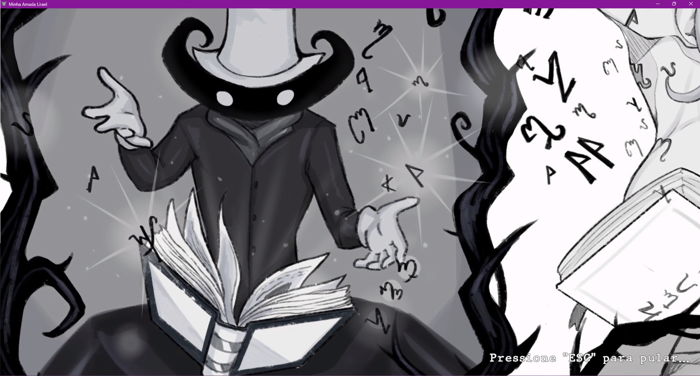
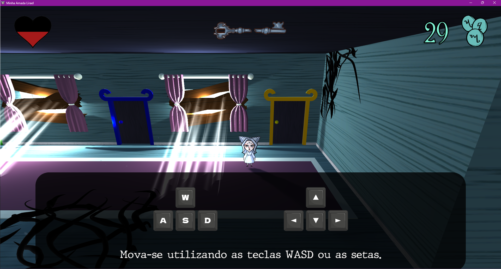
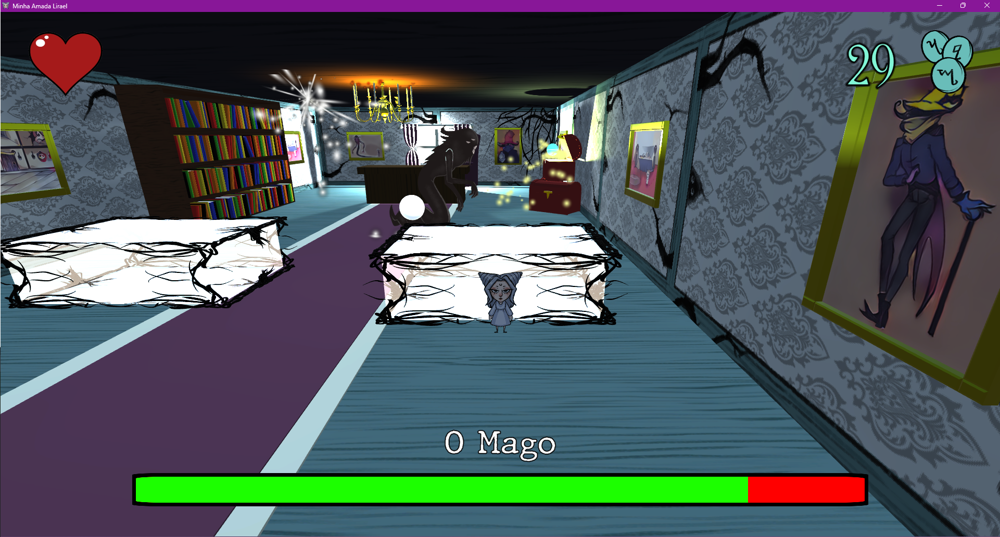

<h1 align="center">Minha Amada Lirael</h1>

A 2.5D adventure game developed on Unity and in C#, for the Faculdade de Tecnologia de Americana college. 
 

This is the group's capstone project, and integrates almost all technologies learned throughout the trajectory of three years of graduation.

 

<a href="https://leonardont.itch.io/minha-amada-lirael" target="_blank">Check this game at itch.io here!</a>

 

 

<h3 align="center">Minha Amada Lirael takes place in a world where magic is marginalized and those who possess it are forced to live in the shadows for their entire lives.</h3>
 
<h4 align="center">The Wizard doesn't believe in this, but rather that those who are magical should be worshipped. His cruelty and ambition have made him known far and wide, feared everywhere, hated by many and ultimately alone. </h4>
<h4 align="center">Discontented with having his entire mansion to himself and motivated to make himself admirable to those who had previously despised him, the Magician wrote down in his magical book the greatest desires of men: a girl with delicate features and no desires, a blank slate to love and adore him, called Lirael.</h4>
<h4 align="center">His obsession with his creation soon prevented him from letting her go free, so the Magician locked her up in his mansion, far from any contact with the outside world. Lirael then, after years of enduring being trapped and confined under that cold roof, knew she had to escape.</h4>

 

 

 

 

 

<h3 align="center"><b>Credits</b></h3>

 

<h3 align="center"><i><b>Artwork</b></i></h3>

Conceptualized and created entirely by Nayumi Menuzzo de Akutagawa

 

<h3 align="center"><i><b>Music</b></i></h3>

Generated using AI prompts with StableAudio (stableaudio.com)

 

<h3 align="center"><i><b>Sounds</b></i></h3>

Sourced from YouTube, Freesound, and Pixabay audio libraries

 

<h3 align="center"><i><b>3D Models</b></i></h3>

Environments conceptualized by Nayumi Menuzzo de Akutagawa

3D models crafted by Enzo de Castro Umehara & Leonardo Nabarro Tonezer

 

<h3 align="center"><i><b>Project</b></i></h3>

<b>3D Artist</b>

Enzo de Castro Umehara

<b>Project Director, C# Developer, Unity Developer, 3D Artist, Animation Developer, Storyboard Artist, Software Documentation Specialist</b>

Leonardo Nabarro Tonezer

<b>C# Developer, Unity Developer, Animation Developer, Storyboard Artist, Software Documentation Specialist</b>

Mileny Fernanda de Souza Clemente

<b>2D Artist, Storyboard Creator</b>

Nayumi Menuzzo de Akutagawa

 

 

<h4 align="center">DISCLAIMER: "Minha Amada Lirael" is a personal project, developed for the "Graduation Work Project II" and "Graduation Work II" subjects, coded "TTG102" and "TTG103" respectively, at Faculdade de Tecnologia de Americana, located in Americana, São Paulo, Brazil.<h4>
<h4 align="center">This project does NOT comercially profit today, has NOT comercially profited in the past, and will NOT comercially profit in the future.</h4>
<h4 align="center">The owners and participants of this project do not sell, endorse the selling or receive any money for the copies of this project.</h4>
 
<h4 align="center">THE HEREBY PROJECT SHALL BE USED ONLY AND EXCLUSIVELY FOR RESEARCH PURPOSES.</h4>

 

 

<h3 align="center">Copyright © 2024 Enzo de Castro Umehara, Leonardo Nabarro Tonezer, Mileny Fernanda de Souza Clemente & Nayumi Menuzzo de Akutagawa</h3>
<h3 align="center">Apache License - Version 2.0</h3>
